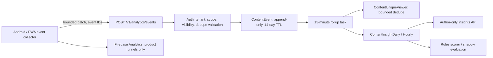

# ADR-006: Content Measurement, Creator Insights, and Recommendation Control

Status: accepted target design
Date: 2026-08-02
Owners: Product, Social Platform, Data, Trust and Safety

## Implementation status (2026-08-07)

M0 measurement is deployed: versioned event ingestion, exact viewer claims,
daily rollups, 14-day raw retention, creator-owned per-content insight APIs,
and a 15-minute Cloud Scheduler rollup run in the production `vybnet`
project. Android and PWA collect bounded event batches; Android exposes
per-content insights and PWA exposes insight and measurement controls.

The design remains ahead of the enabled product. Aggregate creator dashboards,
shared eligibility fixtures, canary evidence, recommendation explanations,
score shadowing, `For You`, interest reset, and Remote Config gates are not
complete. Recommendation feedback must not be interpreted as live ranking
until those gates are explicitly finished.

## Context

Vyb needs social-media-grade content measurement without turning a campus
network into a vanity-count or engagement-at-any-cost system. A raw play,
scroll impression, unique person reached, completed video, save, send, report,
and follow are different facts. Treating them as one `views` counter produces
misleading creator analytics and rewards clickbait.

The pilot target is 20,000-30,000 registered users across two or three
universities, 3,000-6,000 DAU, and 300-800 peak concurrent sessions. The design
must therefore be privacy-preserving, cross-platform consistent, inexpensive,
and useful before enough data exists for machine-learning ranking.

## Decision

Vyb will implement one versioned, server-validated content-event contract,
private creator insights, explicit recommendation controls, and a rules-based
discovery scorer. The Campus and Following feeds remain deterministic and
reverse chronological for the MVP. A personalized `For You` lane may be
enabled only through Remote Config after shadow evaluation and safety gates.

Natural-language sentiment is not a moderation verdict or a direct ranking
penalty. Vyb will first expose an `audience response` summary derived from
observable behavior. Optional sentiment labels are asynchronous, confidence
scored, aggregate-only aids and remain separate from safety classification.

## Metric contract

All event definitions are identical on Android and web/PWA. A client may
observe eligibility, but only the backend accepts, deduplicates, and aggregates
an event.

| Metric | Canonical definition | Notes |
|---|---|---|
| Impression | At least 50% of the content surface is visible for at least 500 ms while the app/page is foregrounded. | A scroll-by shorter than the threshold is not counted. |
| Qualified view | An eligible detail open, or at least 50% visibility for 1 continuous second. | Used for image/text/carousel analysis, not displayed as video plays. |
| Video play | Playback starts with the media visible. | Starts and replays are separate counters. |
| Video view | At least 3 continuous playback seconds, or 30% completion for a short clip, while at least 50% of the player is visible. | Seeking does not manufacture watched time. |
| Reach | Unique eligible viewers in the selected period. | Author self-use, test/admin traffic, crawlers, and unauthorized viewers are excluded. |
| Dwell/watch time | Foreground, visible time bounded by media duration and session state. | Store milliseconds; display human-readable totals/averages. |
| Completion | Highest continuous progress band reached; video completion is 95% or more. | Also supports retention buckets and carousel slide drop-off. |
| Engagement | Reactions, comments/replies, saves, internal sends, external shares, reposts, profile opens, follows gained, and entity action clicks. | Report each action separately and provide a documented aggregate rate. |
| Negative feedback | Fast skip, hide, `Not interested`, mute creator, report, or block. | Report/block are trust signals, never content sentiment. |

Views are non-unique; reach is unique. A single person can create multiple valid
views. Daily ranking uses at most one qualified signal per viewer/content/UTC
day; period and lifetime reach use a separate exact content/viewer claim. Repeated
impressions from the same viewer/content/session are throttled, with a new
eligible impression allowed after 30 minutes or a new deliberate detail open.

### Public and private presentation

- Creator insights are author-only (plus explicitly authorized tenant/trust
  operators) and show that some metrics are delayed or estimated.
- Individual viewers are never listed from impression, watch, or reach data.
- Public raw view counts remain off for the MVP; existing public interaction
  counts may remain.
- Cohort or demographic breakdowns require at least 100 unique accounts per
  bucket. Smaller groups are suppressed, not rounded into a potentially
  identifying answer.
- Creator self-events may be shown separately for debugging but never increase
  reach, recommendation score, or creator performance.

## Creator insights

The post/vibe insight surface supports 24-hour, 7-day, 30-day, and lifetime
ranges where data retention permits. It reports:

- impressions, qualified views, video views, and unique reach;
- follower/non-follower and Campus/Community/Following source distribution;
- reactions, comments, saves, sends, external shares, reposts, and engagement
  rate;
- profile visits and follows gained attributable to the content;
- total/average watch time, completion rate, retention bands, and replay rate;
- carousel slide reach and slide-to-slide drop-off;
- audience response: positive actions, neutral consumption, fast skips/hides,
  and safety feedback, without identifying the viewer;
- freshness and processing status so delayed aggregates are not mistaken for
  live totals.

Reactions and comments may update in near real time. Reach, retention, and
attribution are eventually consistent aggregates.

## Event ingestion and storage

Clients maintain a bounded offline queue and flush no more than 20 events or
every 10-15 seconds. A batch has a strict 20-event/32-KB limit, client-generated
event IDs, schema version, session identifier, source surface, content
reference, visibility duration, playback duration/progress, and event time.
The server supplies the trusted user, tenant, receive time, authorization, and
content ownership.

The analytics endpoint must not accept post text, media bytes, private message
content, contact information, or arbitrary JSON labels. Invalid, stale,
cross-tenant, blocked, deleted, moderated, or otherwise unauthorized content
events are rejected or dropped before aggregation.

### Data Connect model

The physical names may follow the existing schema conventions, but the logical
entities are:

- `ContentEvent`: immutable event ID, tenant/content/author keys, HMAC-derived
  tenant-scoped HMAC viewer key, random non-identifying session key, event type, source, visible/watch/progress
  values, schema version, client time, and server receive time;
- `ContentUniqueViewerDay`: content, HMAC viewer-key, and UTC-date claim used
  for period reach and the one-signal-per-viewer/content/day ranking cap;
- `ContentUniqueViewer`: lifetime content/HMAC-viewer claim for exact lifetime reach;
- `ContentDailyInsight`: retry-safe recomputed counters and watch sums;
- `UserInterestSignal`: decayed affinity by user, author, topic, community, and
  content type, with positive and negative components;
- `ContentFeature`: language/topic, quality, safety state, optional sentiment
  label/confidence, feature version, and computed time;
- `RecommendationExposure`: bounded record of served candidates, rank/reason,
  experiment, and subsequent outcome for offline evaluation.

All ingestion and rollup operations use
Data Connect `@auth(level: NO_ACCESS)` and the generated Admin SDK from the
Cloud Run backend. Event IDs and reach claims have unique keys, while daily
totals are recomputed from retained facts so retries converge safely. Generated GraphQL
operations are compiled before deployment and are not exposed directly to
mobile/web clients.

Raw content events use 14 days during beta. After 30 stable days the default
becomes 7 days; an approved storage incident may temporarily use 3 days.
Unique-day claims expire after 90 days; daily aggregates and lifetime reach
claims remain for the content lifetime or documented deletion period. The
viewer HMAC secret remains stable while retained claims exist.

Firebase Analytics remains the no-extra-ingestion-service product funnel for
screen, activation, and feature adoption events. It is not the creator-insight
source of truth. BigQuery export stays off until a named query/experiment needs
it, the dataset region/retention is approved, and a budget alert exists.

## Recommendation design

### Feed lanes

- `Following`: reverse chronological eligible content from followed accounts.
- `Campus`: reverse chronological eligible tenant content, with existing
  community/audience filters.
- `For You`: optional rules-ranked discovery, disabled at launch until the
  rollout gates below pass.

The user can always return to a transparent chronological lane. A ranking
change cannot silently replace the launch feed.

### Candidate and scoring flow

1. **Eligibility:** tenant, audience, community membership, block in either
   direction, moderation, media readiness, age, deletion, and seen/fatigue
   constraints are applied before scoring.
2. **Candidate sources:** following, joined communities, recent Campus content,
   mutual-network authors, quality/trending content, and a bounded new-creator
   exploration pool.
3. **Rules score:** recency decay; relationship and community affinity;
   normalized save/send/share/comment/follow outcomes; dwell/watch completion;
   content quality; explicit `Show more`/`Show less`/`Not interested`; and
   hide/report/block penalties.
4. **Quality controls:** Bayesian-smoothed rates rather than raw popularity,
   per-author caps, exposure/fatigue caps, duplicate suppression, topic/media
   diversity, and a new-creator allowance.
5. **Mix:** start shadow evaluation at approximately 85% relevance candidates
   and 15% exploration. The mix is remotely configurable and never bypasses
   eligibility or trust rules.
6. **Explanation:** every ranked item has a user-facing reason such as
   `You follow this creator`, `From your community`, or `Popular on your
   campus`, plus `Why this post?`, `Show less`, and `Not interested` controls.

Saves, meaningful comments, internal sends, watch completion, profile opens,
and follows are stronger positive evidence than a raw impression or like.
Fast skips and explicit feedback reduce affinity. Reports and blocks immediately
remove eligibility and enter the trust workflow; they are not merely score
features.

Cold-start users receive recent Campus and joined-community content with a
small, diversity-controlled popular set. No collaborative-filtering or model
training is required for the MVP.

## Sentiment and safety boundary

Hinglish, sarcasm, memes, quoted text, and negative but useful campus news make
single-label sentiment unreliable. Therefore:

- `audience response` is the primary creator-facing summary;
- optional content sentiment is `positive`, `neutral`, `negative`, or `mixed`,
  with language, confidence, and model version;
- low-confidence sentiment is discarded and sentiment is never a sole ranking,
  moderation, or takedown reason;
- toxicity, harassment, self-harm, sexual content, spam, and other safety
  classifiers are separate trust-and-safety features;
- private chats and private comment text are not mined for recommendation
  sentiment without a separately reviewed policy and consent basis.

## APIs

- `POST /v1/analytics/events` - authenticated, bounded, idempotent event
  ingestion.
- `GET /v1/posts/{postId}/insights?range=24h|7d|30d|lifetime` - author-only
  content insight.
- `GET /v1/creators/me/insights?range=...` - aggregate creator insight.
- `GET /v1/feed?mode=following|campus|for_you&cursor=...` - explicit feed lane.
- `PUT /v1/preferences/content/{contentId}` - `show_more`, `show_less`,
  `not_interested`, or reset for that item/topic.
- `POST /v1/recommendations/reset` - clear derived interest signals and restart
  cold-start discovery without deleting social graph/content.

Insights access resolves authorship and tenant role on the server. No caller
may supply an owner ID to read another creator's private metrics.

## Rollout and guardrails

1. **M0 - contract:** shared Android/PWA fixtures, threshold tests, event
   sampling dashboard, and no creator UI or ranking change.
2. **M1 - private insights:** dogfood creator insights and compare sampled raw
   sessions to aggregates. Keep recommendation disabled.
3. **M2 - feedback and shadow score:** ship `Why this post?`, `Show more`,
   `Show less`, and `Not interested`; score without changing order.
4. **M3 - controlled For You:** enable to 5% of one allowlisted campus, then
   25%, 50%, and 100% only when guardrails remain healthy.

Primary success metrics are retained sessions, qualified consumption, saves,
useful sends, and follows. Guardrails are hide/report/block rate, content and
author diversity, new-creator exposure, crash/error rate, latency, ingestion
cost, and chronological-lane usage. A rise in views with worse guardrails is
not success. Remote Config can disable collection beyond essential counters,
creator insights, explicit feedback, or `For You` independently.

## Acceptance criteria

- Android and PWA produce the same eligibility result for every metric fixture.
- Background/offscreen content and sub-threshold scroll-bys do not count.
- Duplicate event IDs and retried batches do not double count.
- Views may exceed reach; reach never includes author self-use or unauthorized
  viewers.
- Blocked, cross-tenant, deleted, unready, and moderated content never becomes
  a recommendation candidate or leaks through insights.
- Insight endpoints are author/authorized-operator only and suppress cohorts
  below the privacy threshold.
- Ranking cannot move the user's position or inject into a chronological feed;
  the existing new-post reconciliation behavior remains intact.
- At expected pilot volume, batched ingestion and rollups stay within database
  connection, storage, latency, and budget guardrails.
- Account deletion, content deletion, analytics opt-out/reset, and retention
  jobs have tested outcomes.

## Consequences

- Vyb gets useful creator and recommendation signals without paying for a
  separate streaming/data platform at pilot scale.
- Aggregate insights are intentionally delayed; the UI must not promise exact
  real-time reach.
- Rules-based ranking is explainable and testable, but less personalized than
  mature ML systems. ML remains a later, separately reviewed decision.
- Event instrumentation, privacy controls, rollup correctness, and abuse
  resistance become release requirements rather than optional analytics work.

## References

- [Instagram Insights definitions](https://www.facebook.com/help/instagram/788388387972460)
- [Instagram Reels insights](https://www.facebook.com/help/instagram/202865988324236?locale=en_GB)
- [LinkedIn content analytics](https://www.linkedin.com/help/linkedin/answer/a564051)
- [LinkedIn post analytics](https://www.linkedin.com/help/linkedin/answer/a516971)
- [X view counts](https://help.x.com/en/using-x/view-counts)
- [YouTube recommendation signals](https://blog.youtube/inside-youtube/on-youtubes-recommendation-system/)
- [Meta Feed ranking stages](https://about.fb.com/news/2018/05/inside-feed-news-feed-ranking/)
- [Firebase Analytics](https://firebase.google.com/docs/analytics)
- [Firebase BigQuery export](https://firebase.google.com/docs/projects/bigquery-export)
