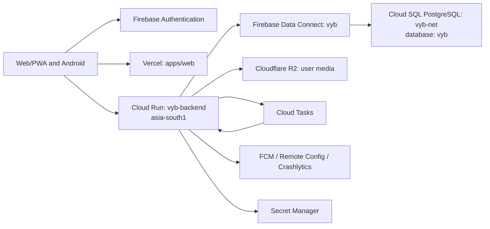

# Vyb Marketplace MVP — High-Level Design

Status: approved target architecture
Last updated: 2026-07-30
Production owner: `ceoutkarshpatel@gmail.com`
Google/Firebase project: `vybnet` (`850600134378`)
GitHub repository: `utkarsh-pat/vyb`

## 1. Goals

- Launch the Marketplace-first MVP in two to three universities.
- Support 20,000–30,000 registered users, 3,000–6,000 DAU, and 300–800 peak concurrent sessions.
- Minimize fixed spend before product-market fit.
- Keep one canonical transactional database, one backend runtime, and one media store.
- Enforce tenant isolation, moderation, auditability, and reversible releases.

Stories, long video, payments, wallet, escrow, anonymous posting, group chat, live streaming, and recommendation ML are outside the initial public launch.

## 2. Production topology

## 3. Locked platform decisions

| Concern | MVP choice | Operating rule |
|---|---|---|
| Identity | Firebase Authentication | Firebase UID is the external identity key; tokens are verified server-side. |
| Transactional data | Firebase Data Connect + Cloud SQL PostgreSQL | Only canonical store for users, tenants, Marketplace, social, resources, chat metadata, and moderation. |
| Backend | One Node modular monolith on Cloud Run | No Vercel backend and no second production writer. |
| Web | Vercel frontend | `vybnet.app` and `www.vybnet.app`; API calls go to `api.vybnet.app`. |
| Android | Native Kotlin/Compose | Release API base URL is `https://api.vybnet.app/`. |
| Media | Cloudflare R2 | Clients use signed upload intent; SQL stores object metadata, not bytes. |
| Async | PostgreSQL outbox + Cloud Tasks | At-least-once delivery; every handler is idempotent. |
| Realtime | Cloud Run WebSocket where needed; FCM offline | Core writes remain durable without realtime availability. Android targets Firebase Installation IDs; legacy registration tokens are migration-only. |
| Feature control | Firebase Remote Config | Stories/video/payments remain off at launch. |
| Observability | Cloud Logging/Monitoring + Crashlytics | Structured logs, request IDs, budget and SLO alerts. |

Firestore is not a fallback database for canonical entities. If retained, it is limited to an explicitly documented ephemeral use case with independent rules and expiry.

## 4. Capacity and scaling

- Cloud Run: 1 vCPU, 512 MiB, concurrency 80, min instances 0, max instances 10.
- Database pool: maximum 5 connections per API instance.
- Cloud SQL: smallest Data Connect-compatible shared configuration, 10 GB SSD, single zone for pilot.
- Add automated backups before external beta. Enable PITR before any paid transaction or university-wide dependency.
- Upgrade database memory before adding API instances when CPU, memory, connection, or p95-query thresholds are breached.
- Use cursor pagination, tenant-leading indexes, bounded result sets, and client/CDN caching.

## 5. Security boundaries

- Resolve tenant, membership, and role from trusted SQL records; never trust client-supplied tenant IDs.
- Require explicit Data Connect authorization and keep generated Admin SDKs server-only.
- Store secrets in Secret Manager or provider-managed encrypted environment variables.
- Never deploy service-account JSON; Cloud Run uses service identity.
- Scope R2 credentials to one bucket, restrict CORS to production origins, and validate MIME, size, ownership, and quota.
- Apply per-IP, per-user, and per-action rate limits; uploads, chat, Marketplace contact, and moderation use stricter limits.
- Use soft delete for user content and append-only audit/moderation events.

## 6. Availability and recovery

- MVP SLO: 99.5% availability.
- API targets: p95 under 500 ms for reads and 800 ms for writes, excluding upload transfer.
- Typed 503 on Data Connect outage; never fall back to another database.
- `/health` is non-networked liveness and `/ready` is non-networked
  configuration readiness; remote synthetic probes run at a deliberately low
  frequency to avoid cost amplification.
- Previous Cloud Run revision remains deployable for application rollback.
- Database changes remain backward-compatible for at least one release.
- Backup restore drill is mandatory before campus-wide launch.
- Direct Android updates are advertised only when a newer version has a
  Vyb-owned HTTPS URL and required SHA-256 digest. The client rechecks the
  digest before install.

## 7. Ownership and deletion rule

All new production resources must be owned by `ceoutkarshpatel@gmail.com` or the GitHub account `utkarsh-pat`. The old shared-account stack is legacy only. It may be deleted only after the new database, backend, frontend, authentication, media, domain, and smoke tests are verified and a local backup record exists.
