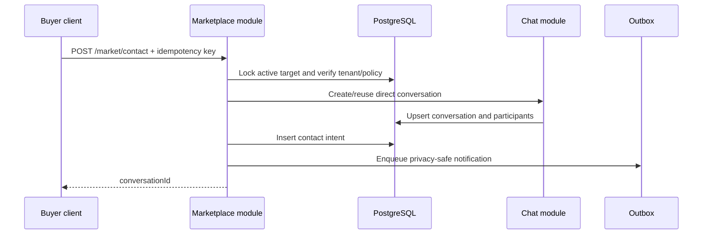

# Marketplace Module LLD

Owner: Marketplace and Trust
Last Updated: 2026-07-28
Phase: MVP
Status: Approved target design; implementation gaps remain
Linked HLD: [HLD](../../architecture/HLD.md)
Linked ADR: [ADR-004](../../architecture/ADR_004_MVP_DATA_AND_MEDIA_TOPOLOGY.md)

## 1. Problem Statement

Verified students need a tenant-local way to sell, request, or lend useful items and then continue safely in one-to-one chat. The initial Marketplace must improve campus liquidity without making Vyb a payment processor, escrow service, delivery partner, or guarantor.

## 2. Scope

In scope:

- sale listings;
- wanted/buying requests;
- lend/borrow requests;
- one to four images;
- category, condition, price or budget, campus handoff spot;
- cursor-based browse, category filter, and bounded search;
- save/unsave;
- contact seller/requester and create/reuse direct chat;
- edit, reserve, mark sold/fulfilled, expire, and soft delete;
- report/block;
- moderation queue and audit events;
- tenant feature flag and per-user publish/contact limits.

Out of scope:

- platform payments, wallet, escrow, refunds, commission, shipping, dispute arbitration, or ownership guarantees;
- auctions and bids;
- external sellers;
- cross-campus discovery by default;
- anonymous posts;
- exact personal address or public phone number;
- automated AI pricing.

## 3. Domain Model

### 3.1 Listing

```text
draft -> active -> reserved -> sold
               \-> expired
active/reserved -> removed
active/reserved -> deleted
```

Fields:

```text
id uuid
tenant_id uuid
seller_user_id uuid
seller_membership_id uuid
title varchar(120)
description varchar(2000)
category varchar(40)
condition varchar(20)
price_minor bigint
currency_code char(3) default 'INR'
campus_spot varchar(120)
status varchar(20)
reserved_for_user_id uuid null
expires_at timestamptz
version integer
created_at, updated_at, deleted_at
```

### 3.2 Request

```text
draft -> active -> fulfilled
               \-> expired
active -> removed/deleted
```

Uses `budget_minor` and `request_kind` (`wanted`, `borrow`) instead of listing price/condition where not applicable.

### 3.3 Media

Media follows the shared upload-intent lifecycle. The listing/request is not `active` until every referenced required media asset is `ready`.

### 3.4 Save

At most one active save per `(listing_id, user_id)`. Soft-deleting and reactivating a save must remain idempotent.

### 3.5 Contact intent

```text
id, tenant_id, target_type, target_id, from_user_id, to_user_id,
conversation_id, idempotency_key, created_at
```

The intent stores no chat plaintext. It links the Marketplace action to a Chat-owned conversation.

## 4. APIs

All APIs require a verified active membership and `marketplace_enabled=true`.

| Method | Path | Purpose |
|---|---|---|
| `GET` | `/v1/market/listings` | Browse listings with cursor/filter/search |
| `GET` | `/v1/market/listings/{id}` | Listing detail with current state |
| `POST` | `/v1/market/listings` | Create listing |
| `PATCH` | `/v1/market/listings/{id}` | Owner edit with version |
| `POST` | `/v1/market/listings/{id}/reserve` | Owner reserve or clear reservation |
| `POST` | `/v1/market/listings/{id}/sold` | Owner marks sold |
| `DELETE` | `/v1/market/listings/{id}` | Owner soft delete |
| `PUT` | `/v1/market/listings/{id}/save` | Idempotent save |
| `DELETE` | `/v1/market/listings/{id}/save` | Idempotent unsave |
| `GET` | `/v1/market/requests` | Browse requests |
| `GET` | `/v1/market/requests/{id}` | Request detail |
| `POST` | `/v1/market/requests` | Create wanted/borrow request |
| `PATCH` | `/v1/market/requests/{id}` | Owner edit |
| `POST` | `/v1/market/requests/{id}/fulfilled` | Owner completes request |
| `DELETE` | `/v1/market/requests/{id}` | Owner soft delete |
| `POST` | `/v1/market/contact` | Create/reuse direct conversation |

The existing `GET/POST /v1/market` dashboard contract remains as a compatibility facade until web and Android move to the resource endpoints.

### 4.1 Browse request

```text
?cursor=opaque
&limit=20
&kind=sale|wanted|lend
&category=books
&condition=good
&minPrice=0
&maxPrice=500000
&q=calculator
&sort=newest
```

Search requires at least two normalized characters. Maximum limit is 50.

### 4.2 Create listing

Headers:

```http
Idempotency-Key: <uuid>
```

Body:

```json
{
  "title": "Engineering calculator",
  "description": "Working condition with cover.",
  "category": "electronics",
  "condition": "good",
  "priceMinor": 120000,
  "currencyCode": "INR",
  "campusSpot": "Main library gate",
  "mediaUploadIds": ["uuid"]
}
```

The server derives tenant, seller, and timestamps.

### 4.3 Contact

Body:

```json
{
  "targetType": "listing",
  "targetId": "uuid",
  "messageTemplate": "is_available"
}
```

The client does not submit seller ID. The backend resolves it from the target row.

Response:

```json
{
  "data": {
    "conversationId": "uuid",
    "created": true
  }
}
```

## 5. Marketplace Contact Sequence



If notification delivery fails, the contact and conversation still succeed. If Chat cannot create the conversation, the transaction rolls back.

## 6. Query Plan

### 6.1 Listings browse

```sql
select id, seller_user_id, title, category, condition, price_minor,
       currency_code, campus_spot, status, created_at
from market_listings
where tenant_id = :tenant_id
  and status = 'active'
  and deleted_at is null
  and (created_at, id) < (:cursor_created_at, :cursor_id)
order by created_at desc, id desc
limit :limit_plus_one;
```

Index:

```sql
create index market_listings_tenant_status_created_idx
on market_listings (tenant_id, status, created_at desc, id desc)
where deleted_at is null;
```

Category index:

```sql
create index market_listings_tenant_category_status_created_idx
on market_listings (tenant_id, category, status, created_at desc, id desc)
where deleted_at is null;
```

### 6.2 Saves

```sql
create unique index market_listing_saves_active_unique
on market_listing_saves (listing_id, user_id)
where deleted_at is null;
```

### 6.3 Contact idempotency

```sql
create unique index market_contacts_idempotency_unique
on market_contacts (tenant_id, from_user_id, idempotency_key);
```

Search may use `pg_trgm` on normalized title and description. It must not perform an unbounded tenant-wide `%term%` scan.

## 7. Authorization and Abuse Controls

- target tenant must equal viewer tenant;
- target must be active and not deleted/removed/expired;
- owner-only edit, reserve, sold, fulfilled, and delete;
- self-contact is rejected;
- blocked users cannot view/contact one another;
- seller phone/email is not returned;
- public responses use username/display name and campus role only;
- contact body is template-based for the first action to reduce spam;
- maximum 10 publishes/day and 20 contacts/day/user initially;
- duplicate images and repeated spam titles may be throttled;
- new accounts may have a configurable Marketplace cooling period;
- suspicious accounts may be restricted without removing general campus access;
- every listing/request supports report and moderation removal;
- high-risk categories are denied by policy.

Prohibited launch categories include weapons, alcohol/tobacco/vapes, controlled substances, prescription medicines, adult services, counterfeit documents, exam cheating material, stolen accounts, financial products, and off-platform cash schemes.

## 8. Safety UX

Each detail/contact screen states:

- transact only with verified campus members;
- meet in a public campus location;
- inspect the item before paying;
- Vyb does not hold funds or guarantee the transaction;
- never share OTP, password, or sensitive identity documents;
- report suspicious behavior.

Marketplace contact cards show the current listing state so sold/removed items cannot appear active forever.

## 9. Observability

Metrics:

- listing/request create success and rejection;
- browse p95 and scanned/returned row ratio;
- active inventory per tenant/category;
- save and contact conversion;
- contact rate-limit denials;
- time to first contact and sold/fulfilled;
- report rate per 1,000 active listings;
- moderator decision time;
- duplicate/idempotency conflicts;
- media inspection failure.

Alerts:

- publish failure above 5% for 10 minutes;
- contact failure above 5%;
- report rate above three times tenant baseline;
- moderation high-severity queue older than 30 minutes;
- browse p95 above 800 ms.

## 10. Rollout

1. migrate ID types and indexes in a backward-compatible release;
2. add resource endpoints behind `marketplace_api_v2`;
3. shadow-read the new browse query;
4. enable internal staff inventory;
5. enable trusted campus ambassadors;
6. open browsing to one campus;
7. open publishing with strict limits;
8. enable contact after moderation/on-call is staffed;
9. add second and third tenants only after tenant-isolation tests and abuse metrics pass;
10. retire the legacy dashboard endpoint after both current client versions migrate.

Rollback disables publishing/contact while leaving read-only access to existing listings. Data is not deleted during rollback.

## 11. Test Plan

- state-machine unit tests;
- owner and cross-tenant authorization tests;
- RLS two-tenant tests;
- idempotent create/save/contact tests;
- concurrent sold/edit/version conflict tests;
- cursor stability under new inserts;
- search index/plan test;
- blocked-user and self-contact tests;
- prohibited category and media-validation tests;
- Chat integration rollback test;
- notification failure isolation test;
- 100 RPS browse and 20 RPS contact load profile;
- web and Android contract tests.

## 12. Current Code Gaps

- the existing dashboard read is not cursor-paginated;
- seller/requester IDs are stored as text in legacy market tables;
- save uniqueness relies on application behavior instead of a partial unique index;
- contacts are separate listing/request tables and do not expose a single idempotent intent;
- lifecycle lacks reserved, expired, fulfilled, and moderation states;
- first contact accepts arbitrary message text;
- detail endpoints and explicit report linkage are missing;
- all production reads and writes use Data Connect; there is no second-database fallback;
- media still uses Firebase-specific server helpers;
- Marketplace is incorrectly described as a later phase in older product docs.

These gaps must be closed before the 20,000-user rollout gate.
